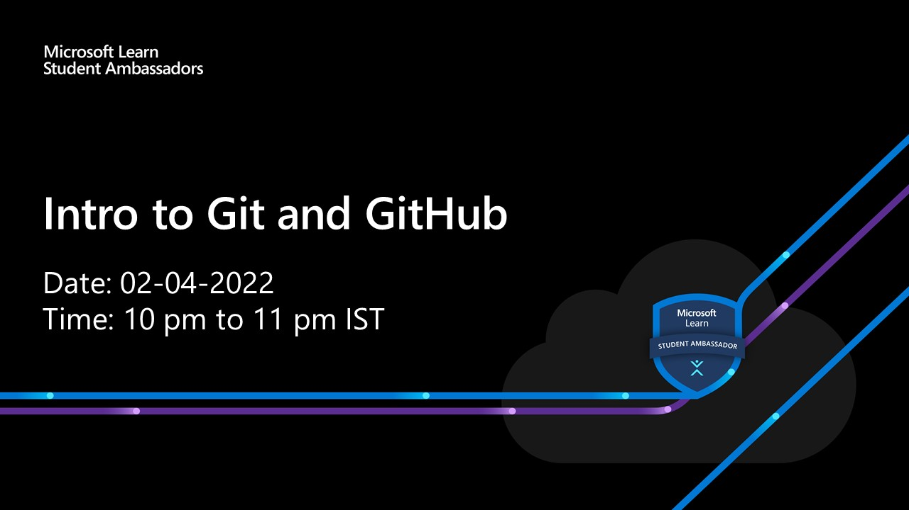

<a class="btn btn-primary" href="https://teams.microsoft.com/l/meetup-join/19%3ameeting_YTU3NzliYzYtNWIwZi00YjBiLWFlYzAtZTdiODI1NDFiMGI3%40thread.v2/0?context=%7b%22Tid%22%3a%2284c31ca0-ac3b-4eae-ad11-519d80233e6f%22%2c%22Oid%22%3a%22ce9effd6-6433-4a6a-977d-e0a7c2f90f92%22%7d" target="_blank">Event Link</a>

Join me in this workshop where you can let about Git and GitHub from the very basics.

Agenda:

1. What is git?
2. Some basic terminal commands
3. Create a repository with a website
4. What is GitHub?
5. Upload your repository to github
6. Publish website using github pages

Missed some part of the event or want to get a head start?
 
[Head over to the documentation and find all the resources for this event.](/docs/intro-to-git-and-github/what-is-git/)
