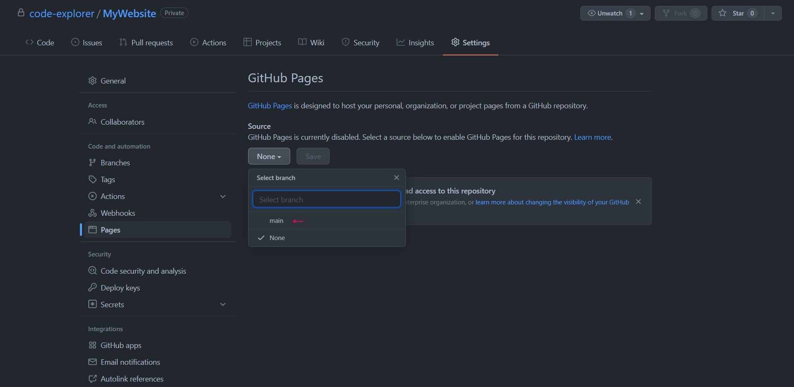

We can now publish our website by first going to the repository on github and clicking on the pages tab under the settings.



Then under source, select the main branch as the source and hit save.

Then wait for a few minutes and the site will be published with the link provided to you.

If you open up the website link provided to you in the pages tab under settings. You will see that the website is blank. This is because we haven't added anything to our website yet.

## Making changes to repository

We can make change to our repository directly on github. Do this by going to the repository page and then hitting `.`

This will open up your repository in VSCode running in your browser.


Update the `index.html` file to look like this:

```html
<html lang="en">
  <head>
    <meta charset="UTF-8" />
    <meta http-equiv="X-UA-Compatible" content="IE=edge" />
    <meta name="viewport" content="width=device-width, initial-scale=1.0" />
    <title>MyWebsite</title>
  </head>
  <body>
      <h1>Hello from GitHub</h1>
  </body>
</html>
```

Then on the left hand side under the source control stage your change and commit your changes.


Finally, if you refresh your website, you can see the changes that you have made.
