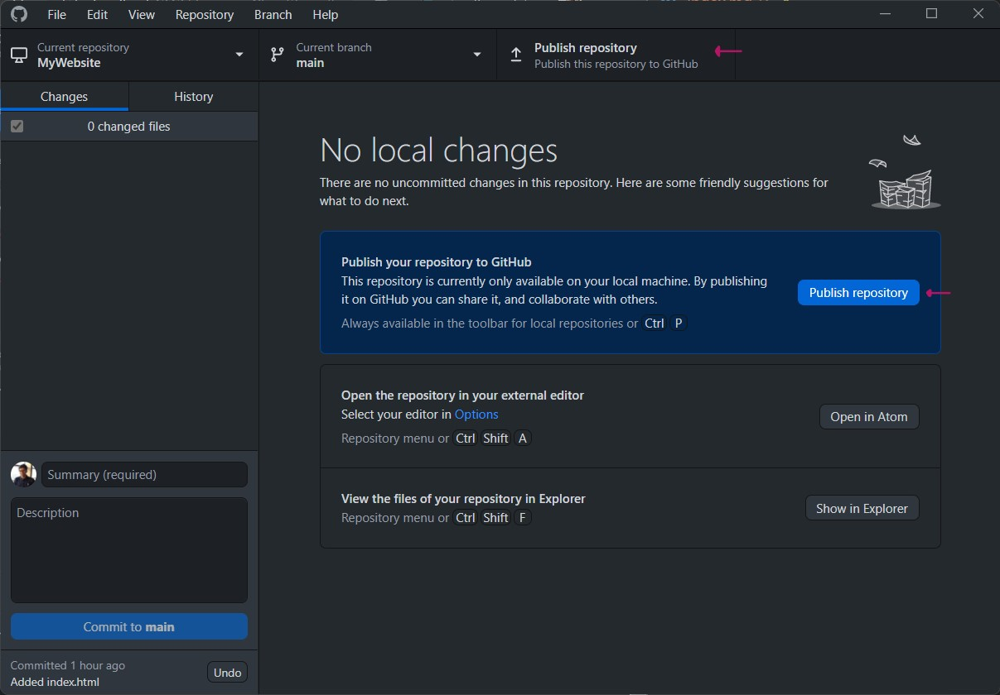

We are going to use GitHub desktop to upload our repository to github.

To get started, open the github desktop application.

To open the repository in github desktop select the `Add an Existing Repository from your hard drive...` option. Then select the folder containing your website.

Now publish the repository to github by selecting the publish repository option.

Now go to [github.com](https://github.com/) or click the `View on GitHub` button to see the published repository on your github account.
