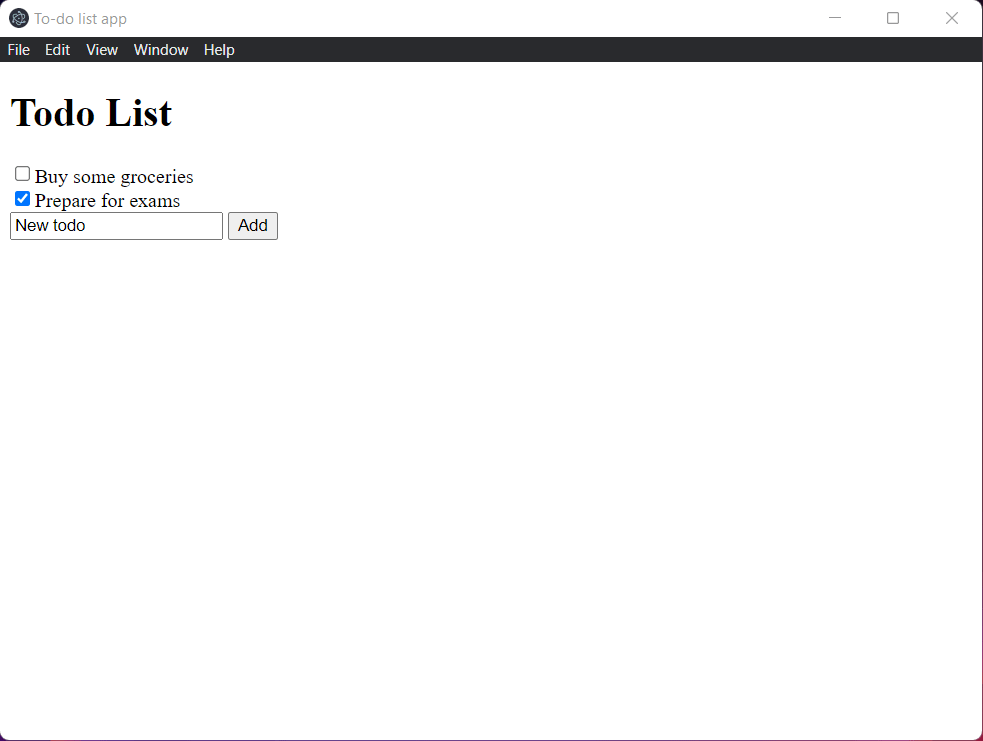

Now let us add some functionality to add some todos.

## Adding text box and button

First, let us add a button and a textbox where we can enter and add todos.

We can do this by adding the following lines of code to the body of our html just below the div which contains the todos.

```html
<input id="add-inp" type="text" />
<button id="add-btn">Add</button>
```

Also let us change the title to say `To-do list app`.

After this, you `index.html` file should look like this.

```html
<!DOCTYPE html>
<html>
  <head>
    <meta charset="UTF-8">
    <!-- https://developer.mozilla.org/en-US/docs/Web/HTTP/CSP -->
    <meta http-equiv="Content-Security-Policy" content="default-src 'self'; script-src 'self'; img-src 'self' blob: data:;">
    <meta http-equiv="X-Content-Security-Policy" content="default-src 'self'; script-src 'self'; img-src 'self' blob: data:;">
    <title>To-do list app</title>
  </head>
  <body>
    <h1>Todo List</h1>
    <div id="todos"></div>

    <input id="add-inp" type="text" />
    <button id="add-btn">Add</button>

    <script src="index.js"></script>
  </body>
</html>
```

## Adding functionality using javascript

To add the functionality to our add button let us first create a function that looks like this:

```javascript
function addTodo() {
  // Get the description from the text box
  let description = document.getElementById("add-inp").value;

  // Add the todo to the list
  Todos.push({
    Description: description,
    Done: false,
  });

  // Display the updated list of todos
  displayTodos(Todos);
}
```

Now let us bind the add button to call this function.

```javascript
document.getElementById("add-btn").addEventListener("click", () => addTodo());
```

After doing this, your `index.js` file should look like this:

```javascript
let Todos = [
  {
    Description: "Buy some groceries",
    Done: false,
  },
  {
    Description: "Prepare for exams",
    Done: true,
  },
];

function displayTodos(todos) {
  // Get the div inside which we are going to store the todos
  todosHTML = document.getElementById("todos");

  // Clear the contents of the div
  todosHTML.innerHTML = "";

  let i = 0;
  todos.forEach((todo) => {
    todosHTML.innerHTML +=
      '<input type="checkbox" id="todo-check-' +
      i +
      '"' +
      (todo.Done ? "checked" : "") +
      "><span>" +
      todo.Description +
      "</span><br/>";
    i++;
  });
}

displayTodos(Todos);

function addTodo() {
  // Get the description from the text box
  let description = document.getElementById("add-inp").value;

  // Add the todo to the list
  Todos.push({
    Description: description,
    Done: false,
  });

  // Display the updated list of todos
  displayTodos(Todos);
}

// Call add todo when add button is clicked
document.getElementById("add-btn").addEventListener("click", () => addTodo());
```

Now run your app and try out your new functionality.

