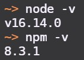
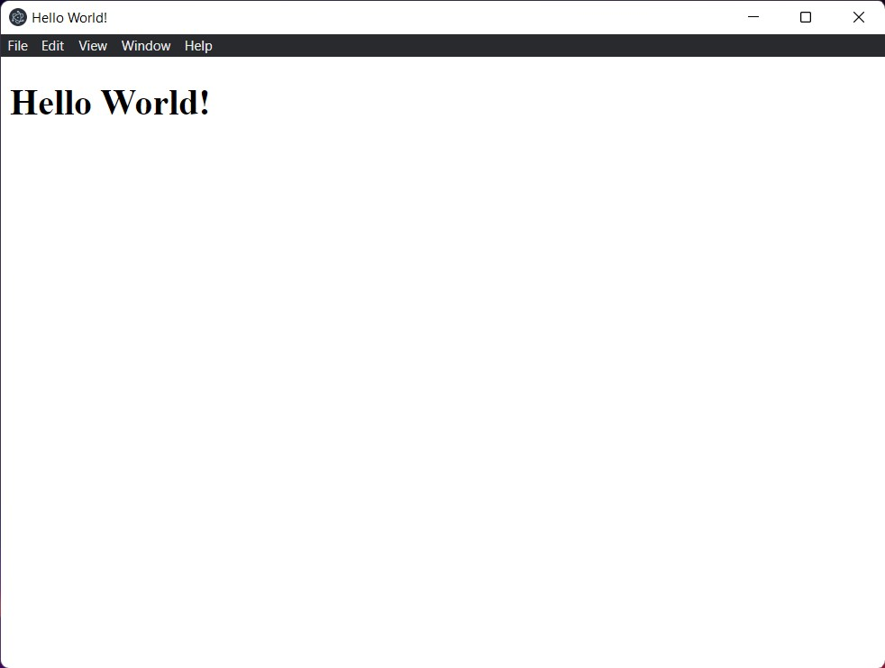

## Installing Node.js

To get started with electron, you need to install [Node.js](https://nodejs.org/en/).

Go to [nodejs.org/en/download/](https://nodejs.org/en/download/) and download the LTS or Long Term Support version. Once its downloaded, install node.js on your system.

### Verify Installation

Once you have installed node.js, you can test your installation by running the following commands in the terminal.

```console
node -v
npm -v
```

On running these you should be able to see the versions of node.js and the node package manager like this, although your version might be different:



## Installing VSCode

VSCode is a light-weight text editor with lots of useful features such as integrated terminal and autocompletion.

To install VSCode, head over to the [official website](https://code.visualstudio.com/).

## Setting up electron

To create an electron app, first create and open the folder for you app inside VSCode.

Then open up the terminal inside VSCode by hitting `Ctrl + J`.

Run the command `npm init` inside the terminal. This is start the setup process for creating your app. You can leave most fields as default or blank by just hitting enter. Make sure you set the entry point as `main.js`.


This command with generate a file named `package.json` which looks like this.

```json
{
  "name": "electron-todo-list",
  "version": "1.0.0",
  "description": "",
  "main": "main.js",
  "scripts": {
    "test": "echo \"Error: no test specified\" && exit 1"
  },
  "author": "Satwik Kambham",
  "license": "MIT"
}
```

### Installing the electron package

Finally we need to install the electron package to do this, run the following command in the terminal:

```console
npm install --save-dev electron
```

Inside the  `package.json` file which was created, replace the lines

```json
"scripts": {
  "test": "echo \"Error: no test specified\" && exit 1"
},
```

with

```json
"scripts": {
  "start": "electron ."
},
```

## Creating the main files

To get our app running we need to create a few files with the following content.

- `main.js` - The starting point of our app

```javascript
// Import from the electron library
const { app, BrowserWindow } = require("electron");

// Function to create a window
function createWindow() {
  const win = new BrowserWindow({
    width: 800,
    height: 600,
  });

  // Load the html file inside the window
  win.loadFile("index.html");
}

// Create the window when the app is initialized
app.whenReady().then(() => {
  createWindow();
});

// Quit the app when the window is closed
app.on("window-all-closed", () => {
  app.quit();
});
```

- `index.html` - The html page displayed on the window

```html
<!DOCTYPE html>
<html>
  <head>
    <meta charset="UTF-8">
    <!-- https://developer.mozilla.org/en-US/docs/Web/HTTP/CSP -->
    <meta http-equiv="Content-Security-Policy" content="default-src 'self'; script-src 'self'; img-src 'self' blob: data:;">
    <meta http-equiv="X-Content-Security-Policy" content="default-src 'self'; script-src 'self'; img-src 'self' blob: data:;">
    <title>Hello World!</title>
  </head>
  <body>
    <h1>Hello World!</h1>
  </body>
</html>
```

You can now run the command `npm start` to start your electron application.


